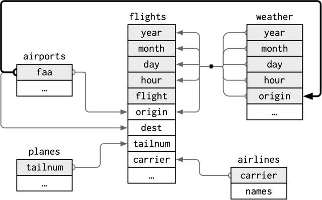

##  New York Flights ✈️ 🧳 🗽 - Python Vs. SQL

source image <a href="https://www.freepik.com/free-vector/plane-fly-blue-sky-with-clouds_21388594.htm#page=3&query=flights%20illustration&position=19&from_view=search&track=ais&uuid=82650d86-0491-4a8c-8ac1-763986dbdfb7">Image by upklyak on Freepik</a>

---

In this exercise, we will compare the implementation of Pandas and SQL for data queries. We'll explore how to use Pandas in a manner similar to SQL by translating SQL queries into Pandas operations. It's important to note that there are various ways to achieve similar results, and the translation of SQL queries to Pandas will be done by employing some of its core methods.

We'll dive into the **nycflights13** dataset, which contains comprehensive data on `airlines`, `airports`, `weather conditions` and `aircraft` for all flights passing through New York airports in 2013. Through this exercise, we'll not only explore Pandas functionality but also learn to apply fundamental SQL concepts in a Python data manipulation environment. This comparison serves as an initial step to delve into translating SQL queries to Pandas, utilizing the available tools in this versatile and powerful library.
 

---

 

### Entity-relationship diagram [ERD]

> The nycflights13 library exclusively comprises tables with flight data from New York airports in 2023. Below, you can find a high-level representation of an entity-relationship diagram with its five tables.

---

